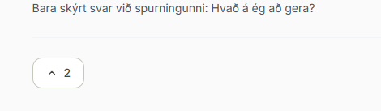

# TODO

## Forgangsröðun

Þetta yfirlit stýrir vinnuröðinni. Númer atriðanna haldast óbreytt svo eldri
tilvísanir og verkefnasaga rofni ekki.

| Röð | Atriði | Forgangur og samhengi |
| --- | --- | --- |
| 1 | **#14 Öryggisforsendur fyrir opna beta** | Sex launch-blockers sem verða að vera leystir og prófaðir áður en whitelist er fjarlægð eða innskráning opnuð almennt. |
| 2 | **#15 Íslenskar dagsetningar á lánaspjöldum** | Afmarkað UI-atriði: laga lánadagsetningu og sýna skiladagsetningu með sama sniði. |
| 3 | **#12 Skýrari kosningatakki** | Lítið UI/copy-atriði sem má loka með núverandi útlitsvinnu án breytinga á kosningavirkni. |
| 4 | **#8 Teskeið-loader** | Byggja standalone preview úr endanlega samþykkta SVG-lógóinu áður en loader er settur í almenna notkun. |
| 5 | **#4 Beta-aðgangur og útgáfustig** | Setja server-side grunnvörn fyrir `off`, `beta` og `public` áður en almenn innskráning er opnuð. |
| 6 | **#13 Umsjón með whitelist í admin** | Sýna og breyta aðgangslistanum með öruggum admin-only aðgerðum eftir að hlutverk hans í #4 hefur verið skilgreint. |
| 7 | **#5 Samræmd mobile app-upplifun** | Samræma innskráningu, form, viewport, keyboard og mobile layout áður en fleiri notendur fá aðgang. |
| 8 | **#7 Langlíf innskráning** | Gera session app-líkt og öruggt eftir mobile-yfirferð, en áður en innskráning er opnuð almennt. |
| 9 | **#9 Opin innskráning með aðgangsstýrðum Teskeiðum** | Lokaáfangi eftir #14, #4, #5 og #7. Beta-merki eða fyrirvari kemur ekki í stað þessara varna. |
| 10 | **#10 Gáfuleg opnun tölfræðisíðu** | Sjálfstætt admin-atriði sem má taka eftir að notendaaðgangsflæðið er tilbúið. |

#14
## Öryggisforsendur fyrir opna beta

**Staða:** Bíður

**Markmið:** Gera almenna Teskeið-innskráningu tæknilega örugga áður en
whitelist er fjarlægð eða óþekktum notendum er hleypt inn. `Beta`-merking og
fyrirvari mega stýra væntingum notenda, en teljast ekki öryggisvörn.

**Launch-regla:** Ekki opna innskráningu almennt og ekki færa TODO #9 í
framkvæmd fyrr en öll sex atriðin hér að neðan hafa verið leyst, prófuð og
rýnd.

### 1. Einangra Teskeið frá eldri authenticated app-flötum

- Teskeið-login býr til venjulegan Supabase `authenticated` notanda.
- Tryggja að Teskeið-notandi fái ekki sjálfkrafa aðgang að eldri slóðum eins
  og `/home`, `/children`, `/contacts`, `/chat` og `/settings`.
- Aðgangsstýring skal vera server-side í middleware/layout/API, ekki aðeins
  falin navigation.
- Skilgreina skýrt hvaða notendategund má nota hvorn vöruflöt.

### 2. Herða aðgang að `profiles`

- Núverandi `profiles_select` notar `USING (true)` fyrir alla
  `authenticated` notendur.
- Rýna og herða policy/grants svo opin Teskeið-skráning gefi ekki nýjum
  notendum óþarfan lestursaðgang að prófílum annarra.
- Varðveita nauðsynleg co-parent display-name flæði í Krakkavaktinni með
  afmörkuðum aðgangi, view eða RPC í stað breiðs almenns aðgangs.
- Bæta regression-prófum fyrir bæði Teskeið og Krakkavaktina.

### 3. Bæta IP- og abuse-rate-limit við innskráningarkóða

- `/api/auth-mvp/request-code` er nú aðeins með mörk á hvert netfang.
- Bæta server-side IP-/abuse-vörn áður en kóði er búinn til eða póstur sendur.
- Takmarka einnig dreifða misnotkun yfir mörg netföng og verja Resend-kostnað.
- Halda API-svörum almennum svo ekki sé hægt að lesa whitelist eða tilvist
  netfangs.
- Skilgreina örugga hegðun þegar rate-limit þjónusta er óaðgengileg.

### 4. Gera OTP-staðfestingu atomic

- Núverandi attempt-increment og `used_at` uppfærsla eru aðskildar aðgerðir.
- Færa lestur, attempt-talningu, samanburðarniðurstöðu og notkun kóða í atomic
  Postgres RPC/transaction svo samhliða beiðnir komist ekki fram hjá mörkum
  eða noti sama kóða oftar en einu sinni.
- Varðveita timing-safe samanburð, TTL og hámarksfjölda tilrauna.
- Bæta concurrency- og replay-prófum.

### 5. Aðskilja session-aðgang og feature-aðgang

- Skipta núverandi `guardTeskeidAccess()` í skýrt session-lag og
  feature-aðgangslag.
- `/auth-mvp/heim` og prófíll skulu nota session-vörn.
- Hver Teskeið, bein slóð, server action, API og RPC-flæði skal nota
  server-side feature-vörn.
- Samræma þetta við TODO #4 (`off`, `beta`, `public`) og TODO #9.
- Ekki treysta á client-side feature-flögg sem öryggisvörn.

### 6. Fjarlægja netföng og viðkvæm gögn úr production-logs

- `lib/auth/email.ts` má ekki logga viðtakandanetfang þegar
  `RESEND_API_KEY` eða önnur tölvupóststilling vantar.
- Yfirfara auth-, loan-, email- og admin-logga fyrir netföng, OTP-kóða,
  tokens, invitation IDs og önnur persónu- eða öryggisgögn.
- Nota aðeins örugg error-code eða almenna metadata sem duga til rekstrargreiningar.
- Bæta prófi eða static regression-check þar sem raunhæft er.

**Lokaprófanir fyrir opna beta:**

- Óþekktur notandi getur skráð sig inn án þess að komast inn í eldri
  Krakkavaktar-flöt eða óútgefnar Teskeiðar.
- Enginn nýr aðgangur að prófílum annarra verður til.
- Request-code og verify-code þola spam, brute force, concurrency og replay.
- Bein slóð, server action, API og RPC framfylgja sömu feature-reglum.
- Production-logs innihalda hvorki netföng, kóða né tokens.
- Kill switches virka áfram og loka aðgangi án gagnabreytinga.

#4
## Beta-aðgangur og útgáfustig fyrir nýjar Teskeiðar

**Staða:** Bíður

**Markmið:** Stebbi og valdir prófarar geti notað nýjar Teskeiðar í production
á meðan almennir notendur sjá aðeins útgefið efni.

Hver Teskeið skal geta verið á einu af þremur útgáfustigum:

- `off`: enginn hefur aðgang
- `beta`: aðeins Stebbi og valdir prófarar hafa aðgang
- `public`: allir viðeigandi innskráðir notendur hafa aðgang

**Tillaga að útfærslu:**

- Geyma release-stage fyrir hverja Teskeið miðlægt.
- Geyma beta-allowlist í gagnagrunni, tengda `feature_key` og `user_id`.
- Búa til eitt sameiginlegt server-side aðgangslag, t.d.
  `guardFeatureAccess(featureKey)`.
- Búa til sameiginlegt yfirlit fyrir viðmótið, t.d.
  `getAvailableFeatures(userId)`.
- Fela óaðgengilegar Teskeiðar í heimaskjá og navigation.
- Verja einnig beinar slóðir, server actions og API endpoints.
- Ekki treysta á client-side eða `NEXT_PUBLIC_*` flagg sem öryggisvörn.
- Halda RPC-functions áfram service-role-only þar sem það á við.
- Bæta við regression-prófum fyrir `off`, `beta`, `public`, óskráðan notanda
  og beina slóð.

**Mikilvæg aðgreining:** Beta-aðgangur í production stýrir sýnileika og
notkun, en einangrar ekki áhættusamar schema-breytingar eða production-gögn.
Stórar eða destructive gagnagrunnstilraunir þurfa áfram sérstakt staging
Supabase-project.

Áður en útfærsla hefst þarf að ákveða hvort release-stage eigi að vera í
gagnagrunni, environment variables eða blandað. Forgangstillaga er DB-stýrt
release-stage og DB-stýrð beta-allowlist svo hægt sé að færa `beta` í `public`
án nýs deploys.

#5
## Samræmd mobile app-upplifun á öllu Teskeið.is

**Staða:** Bíður

**Umfang:** Reglurnar í þessu atriði gilda alls staðar á `teskeid.is`, bæði á
opinberum síðum, innskráningu, prófíl, heimaskjá og inni í öllum Teskeiðum.

**Vandamál:** Í farsíma þysjar vafrinn sjálfkrafa inn þegar notandi slær í
ákveðna innsláttarreiti, meðal annars netfangið á Teskeið-innskráningarsíðunni.
Eftir innslátt þarf notandinn að þysja handvirkt út aftur. Sambærileg
viewport-, keyboard-, overflow- og layout-vandamál mega ekki koma upp annars
staðar á vefnum. Allt `teskeid.is` á að upplifast eins og samræmt mobile app.

**Ósk:**

- Tryggja að engir innsláttarreitir á `teskeid.is` valdi óæskilegu
  mobile-zoom, sérstaklega í Safari/iOS.
- Halda eðlilegri aðgengilegri textastærð og forðast að banna notandanum
  almennt að zooma síðuna.
- Yfirfara öll form og controls á vefnum, þar á meðal netfang, kóða,
  dagsetningar, leit, textarea, select og tengdar auth-síður.
- Endurhanna Teskeið-innskráningarsíðuna samkvæmt `Design.md`, með canonical
  Teskeið-litunum, spacing, typography, controls, focus-visible og
  mobile-first app-upplifun.
- Ekki láta gamalt Krakkavaktar-lúkk leka inn í Teskeið-innskráninguna.
- Nota reglurnar í `Design.md` sem skyldubundið viðmið fyrir alla nýja og
  breytta skjái á `teskeid.is`.
- Prófa sérstaklega við 360-460 px viewport, með mobile keyboard opið og í
  portrait og landscape þar sem það skiptir máli.
- Staðfesta að enginn texti, hnappur eða input skarist og að síðan haldi réttri
  breidd og scroll-stöðu eftir að lyklaborði er lokað.
- Staðfesta að fixed/sticky controls, modals og neðri aðgerðir fari ekki undir
  mobile keyboard, browser chrome eða safe-area.

#7
## Langlíf innskráning með app-líkri mobile-upplifun

**Staða:** Bíður

**Vandamál:** Stuttur eða óvæntur session-timeout getur gert mobile-upplifun
Teskeiðar óþarflega veflega. Notandi sem hefur þegar skráð sig inn á eigin síma
ætti almennt ekki að þurfa að sækja nýjan tölvupóstkóða eftir app-switching,
lokun vafra eða eðlilega óvirkni.

**Markmið:** Innskráning haldist áreiðanlega virk líkt og í appi, sérstaklega á
persónulegum mobile-tækjum, án þess að veikja server-side session-staðfestingu
eða gera stolna session ótímabundna.

**Ósk og atriði til ákvörðunar:**

- Kortleggja núverandi Supabase access-token, refresh-token, cookie-líftíma og
  sjálfvirka session-endurnýjun áður en timeout-hegðun er breytt.
- Nota langlífa, endurnýjanlega session með öruggum refresh-token fremur en að
  gera eitt access-token mjög langlíft.
- Láta innskráningu lifa browserlokun, app-switching, skjálæsingu og eðlilega
  óvirkni þegar notandi er á eigin tæki.
- Ekki treysta eingöngu á user-agent til að ákveða hver fær langa session.
  Meta hvort sama app-líka hegðun eigi við á öllum persónulegum tækjum eða hvort
  bjóða eigi skýrt val á borð við „Haltu mér innskráðum“.
- Halda skýrri „Skrá út“ aðgerð sem afturkallar session á öruggan hátt.
- Ákveða raunhæfan hámarkslíftíma, til dæmis 30-90 daga, og hvort virk notkun
  endurnýi tímann.
- Endurstaðfesta auðkenni síðar fyrir sérstaklega viðkvæmar aðgerðir ef slíkar
  aðgerðir verða hluti af Teskeið.
- Meðhöndla útrunnið eða afturkallað refresh-token án redirect-loopa og varðveita
  ætlaða áfangasíðu eftir nýja innskráningu.
- Prófa Safari/iOS, Chrome/Android, standalone/PWA og venjulegan mobile browser,
  meðal annars browserlokun, tæki offline, token refresh og handvirka útskráningu.
- Bæta regression-prófum fyrir session refresh, expiry, revocation og logout.

**Öryggisviðmið:** Ekki slökkva á expiry alfarið. Langlíf innskráning skal byggja
á öruggri token-endurnýjun, `httpOnly`/secure cookie-hegðun Supabase þar sem það
á við og áframhaldandi server-side auth-vörnum.

#8
## Teskeið-loader sem endar í nýja lógóinu

**Staða:** Bíður

**Hugmynd:** Búa til stutta, leikandi loading-hreyfingu þar sem Teskeið matar
einhvern. Viðkomandi brosir að lokum og myndin umbreytist eða rennur saman við
nýja hringlaga Teskeiðarlógóið.

**Forsenda:** Formlega SVG-lógóið í TODO #6 þarf fyrst að vera hannað og
samþykkt. Loaderinn skal byggja á sömu vector-formum, hlutföllum, litum og
andliti svo loka-frame sé raunverulega lógóið, ekki laus eftirlíking.

**Ósk:**

- Hreyfingin skal vera stutt, skýr og hlý, ekki löng eða endalaust truflandi.
- Sýna skeið fara að munni eða andliti, einfalt mataratriði og bros sem
  niðurstöðu.
- Láta síðasta frame umbreytast mjúklega í hringlaga Teskeiðarlógóið.
- Merkingin á derhúfunni í loka-frame skal vera `A&10`, nákvæmlega eins og í
  endanlega samþykkta lógóinu.
- Halda stílnum minimal, flötum og samræmdum við samþykkta lógóið.
- Nota SVG/CSS animation eða sambærilega létta veflausn, ekki þunga myndbandsskrá.
- Forðast óþarfa dependencies og tryggja að animation valdi ekki layout shift.
- Loaderinn skal virka í litlum mobile-stærðum og á stærri skjám.
- Prófa hvaða biðtímar réttlæta fulla animation. Fyrir mjög stutta bið skal
  forðast flökt eða að sýna aðeins brot úr sögunni.
- Ekki tefja raunverulega navigation eða gagnabirtingu til að animation nái að
  klárast.
- Styðja `prefers-reduced-motion`: sýna kyrrt lógó eða mjög einfalda fade-stöðu
  án matarhreyfingar.
- Tryggja að loader hafi aðgengilegt loading-heiti þar sem það á við, en að
  einstakir skrautlegir SVG-hlutar séu faldir fyrir skjálesurum.
- Útbúa fyrst standalone demo/samanburð fyrir Stebba áður en loaderinn er settur
  inn almennt í navigation eða gagnasöfnun.

#9
## Opin innskráning með aðgangsstýrðum Teskeiðum

**Staða:** Bíður

**Hugmynd:** Innskráning í bottom bar opni Teskeið-innskráningu með netfangi
fyrir alla notendur. Whitelist eigi ekki lengur að loka á innskráninguna eða
`/auth-mvp/heim`, heldur stýra því hvaða Teskeiðar viðkomandi má sjá og nota
inni á heimaskjánum.

**Markmið:** Aðgreina auðkenningu notanda frá aðgangi að einstökum eiginleikum:

- Innskráning staðfestir hver notandinn er.
- `/auth-mvp/heim` og `/auth-mvp/minn-profill` eru aðgengileg öllum rétt
  innskráðum notendum.
- Whitelist eða release-stage stýrir aðgangi að hverri Teskeið.
- Óaðgengilegar Teskeiðar eru faldar, læstar eða merktar `Væntanlegt` eftir
  þeirri upplifun sem verður ákveðin.

**Tillaga að útfærslu:**

- Fjarlægja allowlist-höfnun úr beiðni og staðfestingu á innskráningarkóða, en
  halda svörum almennum svo þau leki ekki upplýsingum um skráð netföng.
- Skipta núverandi `guardTeskeidAccess()` í skýr aðgangslög, til dæmis:
  - `guardTeskeidSession()` fyrir virka innskráningu.
  - `guardFeatureAccess(featureKey)` fyrir aðgang að einstakri Teskeið.
- Nota session-guard fyrir `/auth-mvp/heim` og `/auth-mvp/minn-profill`.
- Verja beinar Teskeiðarslóðir, server actions, API routes og RPC-flæði
  server-side. Ekki treysta aðeins á sýnileika í viðmótinu.
- Nota núverandi `auth_mvp_allowlist` tímabundið sem beta-lista fyrir
  `Lánað og skilað`, án þess að veikja núverandi SQL-varnir.
- Samræma lausnina síðar við release-stage kerfið í TODO #4:
  `off`, `beta` og `public`.
- Ákveða hvort óheimilaður notandi sjái læsta Teskeið eða aðeins
  `Væntanlegt`, án þess að upplýsa um innri aðgangsreglur.

**Öryggi og misnotkunarvarnir:**

- Halda rate limiting á beiðnum um innskráningarkóða og staðfestingartilraunum.
- Meta CAPTCHA eða sambærilega vörn ef opin kóðasending veldur misnotkun eða
  óþarfa tölvupóstkostnaði.
- Ekki leka því hvort netfang, notandi eða Teskeið sé á whitelist.
- Halda allri feature-aðgangsstýringu server-side og varðveita RLS, grants og
  service-role mörk.

**Prófanir:**

- Óinnskráður notandi kemst á innskráningarsíðuna en ekki inn á `/heim`.
- Netfang utan whitelist getur fengið kóða, skráð sig inn og séð `/heim`.
- Sami notandi kemst ekki inn í beta-Teskeið með beinni slóð, API eða action.
- Whitelist-notandi fær áfram fullan aðgang að `Lánað og skilað`.
- Rate limiting, röng kóðahegðun, útrunninn kóði og almenn villuskilaboð virka
  áfram án upplýsingaleka.

#10
## Gáfuleg opnun tölfræðisíðu út frá nýjustu heimsókn

**Staða:** Bíður

**Vandamál:** Núverandi val á upphafstímabili tölfræðisíðunnar má ekki reiða sig
á cookie, `localStorage` eða sambærilegt client-side gildi sem getur vantað,
verið úrelt eða verið ósamræmt milli tækja og vafra.

**Ósk:** Í hvert skipti sem tölfræðisíðan er opnuð skal skoða hvenær raunveruleg
nýjasta heimsókn notandans átti sér stað og velja tímabilið beint út frá því
hversu langt er liðið síðan þá.

**Tillaga að hegðun:**

- Geyma eða lesa síðustu staðfestu heimsókn úr áreiðanlegum server-side
  gagnagrunni.
- Við opnun skal fyrst lesa fyrri heimsókn, reikna liðinn tíma og velja rétt
  tölfræðitímabil.
- Skrá núverandi heimsókn aðeins eftir að fyrri heimsókn hefur verið lesin, svo
  nýja timestampið eyðileggi ekki útreikninginn.
- Skilgreina skýra fallback-hegðun fyrir fyrstu heimsókn og þegar gögn vantar
  eða lestur mistekst.
- Ekki láta client-side hydration eða seinni state-uppfærslu opna fyrst rangt
  tímabil og stökkva síðan yfir á rétt tímabil.
- Forðast race conditions ef sama síða er opnuð samtímis í fleiri en einum
  flipa eða tæki.
- Taka ákvörðun um hvort „heimsókn“ merkir opnun tölfræðisíðunnar, innskráningu
  í admin eða aðra staðfesta virkni.

**Prófanir:**

- Fyrsta heimsókn velur skilgreint sjálfgefið tímabil.
- Stutt frávera velur stutt tímabil.
- Lengri frávera velur samsvarandi lengra tímabil.
- Ógilt eða vantað heimsóknargildi veldur ekki röngu upphafsfilteri.
- Fyrsta render sýnir strax rétt tímabil án sýnilegs filter-stökks.
- Samtímaopnanir skemma ekki næsta útreikning.

#15
## Íslenskar dagsetningar á lánaspjöldum

**Staða:** Bíður

**Vandamál:** Lánadagsetning á spjaldi blandar saman íslensku og ensku, til
dæmis: „Lánað laugardaginn June 6, 2026“. Þegar hlut hefur verið skilað sést
heldur ekki skýrt hvenær skilin áttu sér stað.

**Ósk:**

- Breyta lánadagsetningunni í fullíslenska framsetningu:
  „Lánað laugardaginn 6. júní, 2026“.
- Þegar `returned_at` er til staðar skal einnig birta „Skilað“ á spjaldinu með
  sama dagsetningarsniði, til dæmis:
  „Skilað sunnudaginn 7. júní, 2026“.
- Nota íslensk heiti vikudaga og mánaða, dag mánaðar sem tölu og fullt ártal.
- Reikna `returned_at` í `Atlantic/Reykjavik` svo UTC-tímastimpill færi
  skiladagsetninguna ekki óvart um dag.
- Halda enskri framsetningu eðlilegri þegar enskt tungumál er virkt.
- Setja notendatexta í `messages/is.json` og `messages/en.json`, ekki
  hardcode-a hann í component.

**Prófanir:**

- `2026-06-06` birtist sem „Lánað laugardaginn 6. júní, 2026“ á íslensku.
- Skilaður hlutur sýnir bæði lánadagsetningu og skiladagsetningu.
- Óskilaður hlutur sýnir enga „Skilað“-línu.
- `returned_at` nálægt miðnætti birtir réttan dag í `Atlantic/Reykjavik`.
- Enskt locale sýnir ekki íslensk heiti vikudaga eða mánaða.

#12
## Skýrari kosningatakki á hugmyndasíðum

**Staða:** Bíður

**Vandamál:** Núverandi kosningatakki sýnir aðeins ör og atkvæðafjölda. Það er
ekki nógu skýrt hvað atkvæðið merkir eða hvaða áhrif aðgerðin hefur.

**Ósk:** Láta takkann segja skýrt að notandinn vilji sjá hugmyndina verða hluta
af Teskeið. Orðalag gæti verið á borð við:
„Já, ég vil hafa þetta í Teskeið“.

**Við útfærslu:**

- Velja stutt, náttúrulegt íslenskt orðalag sem passar í takkann á mobile.
- Halda atkvæðafjöldanum sýnilegum án þess að merking hans verði óljós.
- Gera valið og óvalið state skýrt, bæði sjónrænt og fyrir skjálesara.
- Varðveita núverandi kosningavirkni, API-hegðun og vörn gegn tvöföldum
  atkvæðum.
- Setja notendatextann í viðeigandi `messages/is.json` og `messages/en.json`,
  ekki hardcode-a hann í component.

#13
## Umsjón með whitelist í admin

**Staða:** Bíður

**Markmið:** Admin geti séð núverandi whitelist, bætt netfangi við listann og
fjarlægt netfang af honum án þess að þurfa að keyra SQL handvirkt.

**Ósk:**

- Bæta afmörkuðu whitelist-yfirliti við núverandi admin-viðmót.
- Sýna netföng á listanum og viðeigandi lýsigögn sem þegar eru geymd, til dæmis
  athugasemd og skráningartíma.
- Leyfa admin að bæta við netfangi með skýrri staðfestingu.
- Leyfa admin að fjarlægja netfang með staðfestingarskrefi sem minnkar líkur á
  mistökum.
- Normalisera netföng á sama hátt og núverandi auth- og loan-flæði, meðal
  annars með `trim` og lágstöfum.
- Sýna skýr skilaboð fyrir tvítekið netfang, ógilt netfang og misheppnaða
  aðgerð.

**Öryggi og gagnavernd:**

- Allur lestur og allar breytingar skulu vera varðar server-side með núverandi
  admin-auth, ekki aðeins með földu client-viðmóti.
- Ekki veita `anon` eða `authenticated` beinan lesturs- eða skrifaðgang að
  `auth_mvp_allowlist`.
- Nota afmarkað admin API/server action og varðveita núverandi RLS og grants.
- Ekki skila whitelist-gögnum í logs, almenn API-svör eða client-cache sem
  óviðkomandi notandi getur lesið.
- Ákveða við útfærslu hvernig listinn tengist beta-aðgangi í #4 og opinni
  innskráningu í #9, svo sama tafla fái ekki tvær ósamræmdar merkingar.

**Prófanir:**

- Óinnskráður og venjulegur innskráður notandi fá engan aðgang að listanum eða
  breytingaaðgerðum.
- Admin getur lesið lista, bætt við gildu netfangi og fjarlægt færslu.
- Tvítekið og ógilt netfang breytir ekki gögnum.
- Fjarlæging á netfangi hefur skilgreind áhrif á núverandi session og virkan
  Teskeið-aðgang.
