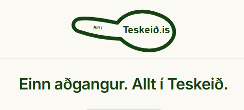
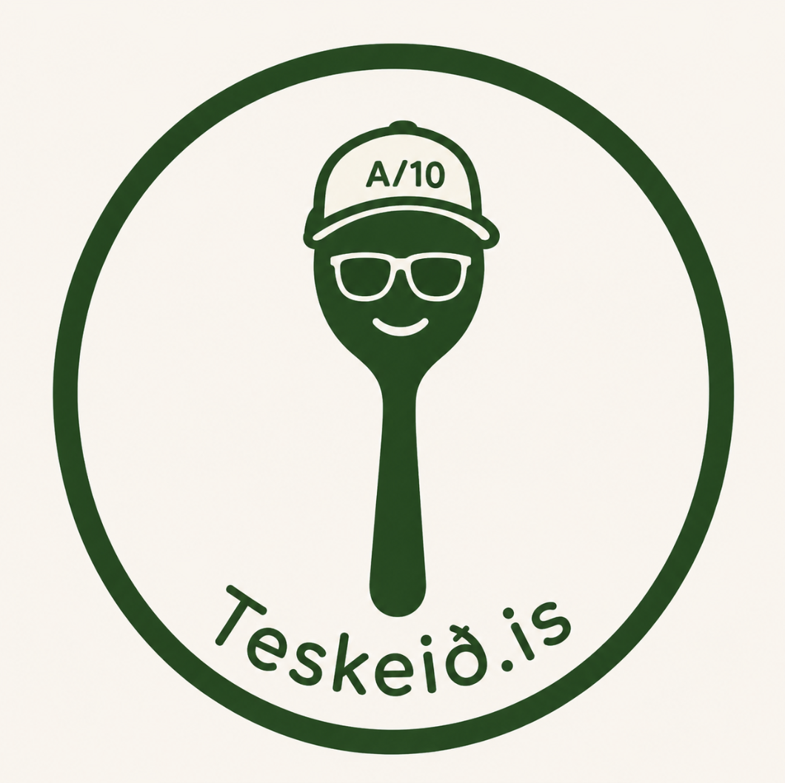

# TODO

#1
Búa til lendingarsíðu fyrir notanda
Já, þetta er gott næsta verkefni eftir að lánaflæðið er klárað og rýnt, svo tveir agentar séu ekki að vinna í sömu skrám.

Lendingarsíðan ætti að:

Vera fyrsta síða innskráðra notenda.
Nota núverandi Teskeið header, liti, letur, spacing og UI components.
Heilsa notanda með display_name.
Sýna „Hvað er á dagskrá?“ með virkum flýtileiðum.
Setja „Lánað og skilað“ fremst og sýna raunverulegan fjölda opinna boða.
Hafa „Nýlegt“ byggt á raunverulegum gögnum, ekki sýnidæmum.
Vera þétt og gagnleg, ekki markaðslendingarsíða.
Virka vel í farsíma og desktop.
Geyma allan texta í messages/is.json og messages/en.json.
Ekki breyta núverandi lánaflæði eða öryggisreglum.
Ég myndi ekki láta Claude hefja þetta fyrr en sql/36 og valfrjálsa netfangið eru samþykkt. Þá getum við fyrst látið Claude skoða núverandi app-shell og leggja fram nákvæma síðuáætlun án breytinga.

#4
## Beta-aðgangur og útgáfustig fyrir nýjar Teskeiðar

**Staða:** Bíður

**Markmið:** Stebbi og valdir prófarar geti notað nýjar Teskeiðar í production
á meðan almennir notendur sjá aðeins útgefið efni.

Hver Teskeið skal geta verið á einu af þremur útgáfustigum:

- `off`: enginn hefur aðgang
- `beta`: aðeins Stebbi og valdir prófarar hafa aðgang
- `public`: allir viðeigandi innskráðir notendur hafa aðgang

**Tillaga að útfærslu:**

- Geyma release-stage fyrir hverja Teskeið miðlægt.
- Geyma beta-allowlist í gagnagrunni, tengda `feature_key` og `user_id`.
- Búa til eitt sameiginlegt server-side aðgangslag, t.d.
  `guardFeatureAccess(featureKey)`.
- Búa til sameiginlegt yfirlit fyrir viðmótið, t.d.
  `getAvailableFeatures(userId)`.
- Fela óaðgengilegar Teskeiðar í heimaskjá og navigation.
- Verja einnig beinar slóðir, server actions og API endpoints.
- Ekki treysta á client-side eða `NEXT_PUBLIC_*` flagg sem öryggisvörn.
- Halda RPC-functions áfram service-role-only þar sem það á við.
- Bæta við regression-prófum fyrir `off`, `beta`, `public`, óskráðan notanda
  og beina slóð.

**Mikilvæg aðgreining:** Beta-aðgangur í production stýrir sýnileika og
notkun, en einangrar ekki áhættusamar schema-breytingar eða production-gögn.
Stórar eða destructive gagnagrunnstilraunir þurfa áfram sérstakt staging
Supabase-project.

Áður en útfærsla hefst þarf að ákveða hvort release-stage eigi að vera í
gagnagrunni, environment variables eða blandað. Forgangstillaga er DB-stýrt
release-stage og DB-stýrð beta-allowlist svo hægt sé að færa `beta` í `public`
án nýs deploys.

#5
## Samræmd mobile app-upplifun á öllu Teskeið.is

**Staða:** Bíður

**Umfang:** Reglurnar í þessu atriði gilda alls staðar á `teskeid.is`, bæði á
opinberum síðum, innskráningu, prófíl, heimaskjá og inni í öllum Teskeiðum.

**Vandamál:** Í farsíma þysjar vafrinn sjálfkrafa inn þegar notandi slær í
ákveðna innsláttarreiti, meðal annars netfangið á Teskeið-innskráningarsíðunni.
Eftir innslátt þarf notandinn að þysja handvirkt út aftur. Sambærileg
viewport-, keyboard-, overflow- og layout-vandamál mega ekki koma upp annars
staðar á vefnum. Allt `teskeid.is` á að upplifast eins og samræmt mobile app.

**Ósk:**

- Tryggja að engir innsláttarreitir á `teskeid.is` valdi óæskilegu
  mobile-zoom, sérstaklega í Safari/iOS.
- Halda eðlilegri aðgengilegri textastærð og forðast að banna notandanum
  almennt að zooma síðuna.
- Yfirfara öll form og controls á vefnum, þar á meðal netfang, kóða,
  dagsetningar, leit, textarea, select og tengdar auth-síður.
- Endurhanna Teskeið-innskráningarsíðuna samkvæmt `Design.md`, með canonical
  Teskeið-litunum, spacing, typography, controls, focus-visible og
  mobile-first app-upplifun.
- Ekki láta gamalt Krakkavaktar-lúkk leka inn í Teskeið-innskráninguna.
- Nota reglurnar í `Design.md` sem skyldubundið viðmið fyrir alla nýja og
  breytta skjái á `teskeid.is`.
- Prófa sérstaklega við 360-460 px viewport, með mobile keyboard opið og í
  portrait og landscape þar sem það skiptir máli.
- Staðfesta að enginn texti, hnappur eða input skarist og að síðan haldi réttri
  breidd og scroll-stöðu eftir að lyklaborði er lokað.
- Staðfesta að fixed/sticky controls, modals og neðri aðgerðir fari ekki undir
  mobile keyboard, browser chrome eða safe-area.

#6
## Endurhanna lógó Teskeiðar

**Staða:** Bíður

### Samþykkt aðalviðmið

**Vandamál:** Samþykkta lógóhugmyndin er nú til sem raster-viðmiðsmynd en ekki
sem hreint, skalanlegt og production-ready SVG. Það þarf að endurgera hana eins
nákvæmlega og mögulegt er í vector-formi, ekki hanna almennt eða lauslega tengt
val.

**Forgangur:** Hringlaga skeiðarmaskottið á nýju viðmiðsmyndinni er samþykkta
aðalstefnan. Eldri lárétta skeiðarhugmyndin hér að ofan er varðveitt sem saga og
samhengi, en á ekki að stýra SVG-endurgerðinni.

**Viðmið úr skjámynd Stebba:**

- Hringlaga badge með þykkum dökkgrænum ytri hring.
- Hlýr off-white eða mjög ljós krembakgrunnur.
- Upprétt dökkgræn skeið, miðjuð lóðrétt.
- Einfalt vinalegt andlit með ljósum sólgleraugum og litlu brosi.
- Baseball-húfa með ljósu framstykki, dökkgrænni útlínu og skyggni.
- Textinn `A/10` miðjaður á framstykki húfunnar.
- Boginn texti `Teskeið.is` eftir neðri innri boga hringsins.
- Enginn glans eða shiny highlight á skeiðinni.
- Lúkkið skal vera minimal, hreint, flatt, örlítið leikandi og svolítið
  cheeky án þess að verða flókið.
- Litatillaga: dökkgrænn nálægt `#145A32` og hlýr ljós litur nálægt `#F7F4EE`.

**Ósk:**

- Endurgera samþykkta mynd eins nákvæmlega og mögulegt er sem handunnið inline
  SVG. Ekki búa til generic alternative, raster-mynd eða canvas-lausn.
- Ytri hringurinn skal vera ráðandi rammi, skeiðin sitja þægilega í miðju,
  húfan sitja eðlilega og bogni textinn vera skýrt læsilegur.
- Tryggja að lógóið skali hreint og haldist skarpt og auðþekkjanlegt í navbar,
  profile-marki, favicon/app-icon og stærri birtingu.
- Búa til reusable React component:
  `TeskeidLogo.tsx`.
- Component skal nota inline SVG og engin external dependencies.
- Props:
  - `size?: number`, sjálfgefið `160`
  - `className?: string`
  - `showBackground?: boolean`
- Þegar `showBackground` er `false` skal SVG-bakgrunnurinn vera transparent en
  ytri hringur, maskott og aðrir lógóhlutar haldast.
- Aðgengi:
  - `<title>Teskeið.is logo</title>`
  - styðja decorative notkun með `aria-hidden` þar sem við á
- Nota SVG paths, circles, `textPath` og grouped shapes eftir þörfum, með hreinni
  og viðhaldanlegri vector-uppbyggingu.
- Skila component-skránni og stuttum usage-dæmum fyrir sjálfgefna stærð, lítinn
  navbar og stærri hero.
- Ekki skipta út núverandi logo-assets eða setja nýja componentinn í production
  UI fyrr en Stebbi hefur séð samanburð við viðmiðsmyndina og samþykkt útkomuna.

#7
## Langlíf innskráning með app-líkri mobile-upplifun

**Staða:** Bíður

**Vandamál:** Stuttur eða óvæntur session-timeout getur gert mobile-upplifun
Teskeiðar óþarflega veflega. Notandi sem hefur þegar skráð sig inn á eigin síma
ætti almennt ekki að þurfa að sækja nýjan tölvupóstkóða eftir app-switching,
lokun vafra eða eðlilega óvirkni.

**Markmið:** Innskráning haldist áreiðanlega virk líkt og í appi, sérstaklega á
persónulegum mobile-tækjum, án þess að veikja server-side session-staðfestingu
eða gera stolna session ótímabundna.

**Ósk og atriði til ákvörðunar:**

- Kortleggja núverandi Supabase access-token, refresh-token, cookie-líftíma og
  sjálfvirka session-endurnýjun áður en timeout-hegðun er breytt.
- Nota langlífa, endurnýjanlega session með öruggum refresh-token fremur en að
  gera eitt access-token mjög langlíft.
- Láta innskráningu lifa browserlokun, app-switching, skjálæsingu og eðlilega
  óvirkni þegar notandi er á eigin tæki.
- Ekki treysta eingöngu á user-agent til að ákveða hver fær langa session.
  Meta hvort sama app-líka hegðun eigi við á öllum persónulegum tækjum eða hvort
  bjóða eigi skýrt val á borð við „Haltu mér innskráðum“.
- Halda skýrri „Skrá út“ aðgerð sem afturkallar session á öruggan hátt.
- Ákveða raunhæfan hámarkslíftíma, til dæmis 30-90 daga, og hvort virk notkun
  endurnýi tímann.
- Endurstaðfesta auðkenni síðar fyrir sérstaklega viðkvæmar aðgerðir ef slíkar
  aðgerðir verða hluti af Teskeið.
- Meðhöndla útrunnið eða afturkallað refresh-token án redirect-loopa og varðveita
  ætlaða áfangasíðu eftir nýja innskráningu.
- Prófa Safari/iOS, Chrome/Android, standalone/PWA og venjulegan mobile browser,
  meðal annars browserlokun, tæki offline, token refresh og handvirka útskráningu.
- Bæta regression-prófum fyrir session refresh, expiry, revocation og logout.

**Öryggisviðmið:** Ekki slökkva á expiry alfarið. Langlíf innskráning skal byggja
á öruggri token-endurnýjun, `httpOnly`/secure cookie-hegðun Supabase þar sem það
á við og áframhaldandi server-side auth-vörnum.
