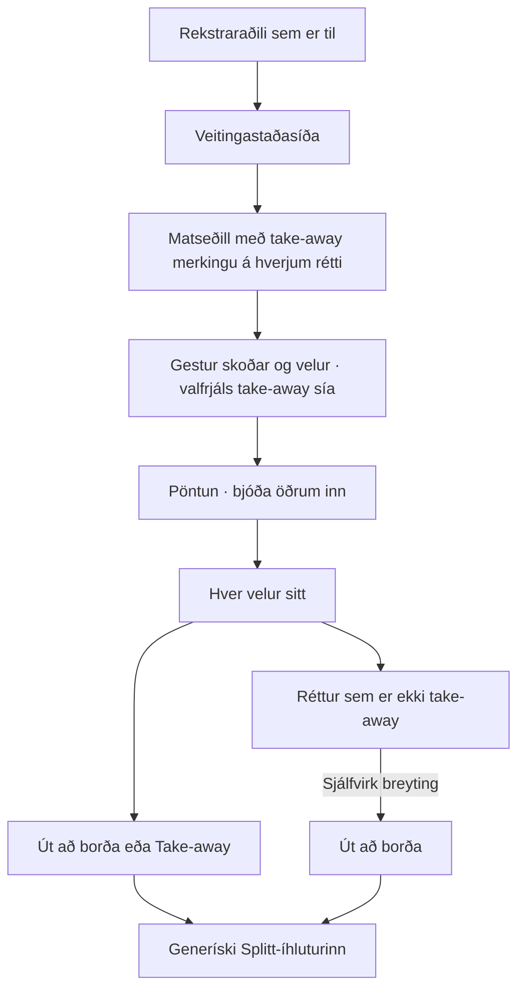

# Veitingastaðasíða og sameiginleg pöntun → Út að borða / Take-away → Splitt

External ID: `restaurant-digital-menu-to-split`
Created: 2026-09-19 00:01
Updated: 2026-09-19 07:49
Timezone: Atlantic/Reykjavik

[Verkefnið í GoLive](https://goliveplaybook.com/roadmap?project=1bb6e3fa-ab25-48c0-a806-342465ee5ded&task=f08f2e57-45c3-43a7-8de2-a28238235807)

GoLive heldur authoritative status, priority, ownership og næsta skrefi.
Þetta er eina canonical tæknilega verkefnisskilgreiningin.

## Markmið og MVP

Byggja aðlaðandi, vandaða veitingastaðasíðu sem Stebbi getur sýnt og selt
veitingastöðum. Notendur geta strax prófað matseðilsval, sameiginlega pöntun
og sjálfvirka tengingu við fyrirliggjandi generíska Splitt-íhlutinn.

MVP hefur tvo hluta: rekstraraðilinn heldur utan um stað og matseðil; venjulegir
gestir byggja pöntun saman. Pöntun er miðjan í gestaupplifuninni. Notandinn þarf
hvorki að stofna Splitt handvirkt né tengjast borði til að nota flæðið.

Þessi ákvörðun Stebba leysir af hólmi eldri nálgun þar sem Splitt var skilgreint
sem eina pöntunareiningin og take-away var utan fyrstu afhendingar. Pöntun er
nú samþykkt vörusamhengi; tæknileg geymsla og tenging hennar við Splitt verður
útfærð í sér samningsáfanga. Ekki ákveða nýtt fjárhags- eða uppgjörskerfi af því tilefni.

## Rekstraraðili og veitingastaðasíða

- Veitingastaður hangir á rekstraraðila sem er þegar til í Teskeið.
  Endurnýta `business_profiles`; ekki búa til annan rekstraraðilagrunn.
- Rekstraraðili skráir/upplýsir staðinn og býr til og birtir matseðil.
- Hver réttur hefur heiti, lýsingu, verð, framboð og skýra merkingu um hvort
  **take-away sé mögulegt**. Take-away merking er ekki það sama og framboð.
- Veitingastaðasíðan er aðalhönnunarverkefnið: skýr auðkenning staðarins,
  aðlaðandi framsetning staðar og matseðils, auðvelt val og góður lestur í síma.
  Endanlegir efnis-/myndareitir afmarkast í hönnun; ekki lofa óstaðfestum eiginleikum.
- Owner getur preview-að og birt efni án handvirkra SQL-færslna eða API-kalla.
- Fyrsti raunstaður og matseðill nota gögn frá eiganda. Fixtures eru merkt
  prófgögn og ekki kynnt sem raunverulegur staður eða verð.

## Gestaflæði

1. Gestur skoðar veitingastað og matseðil.
2. Hann getur valið að sjá aðeins take-away rétti áður en hann velur, en þarf
   þess ekki. Einnig er hægt að velja fyrirfram hvort ætlunin sé Út að borða
   eða Take-away. Sía og tegund pöntunar eru aðskilin hugtök.
3. Gestur velur rétti og magn. Hann getur boðið öðrum inn á sína pöntun;
   við sameiginlega flæðið verður til Pöntun sem þátttakendur velja inn á.
   Engin krafa um að bjóða öðrum áður en notandi getur valið sitt.
4. Hver þátttakandi velur sitt inn á sömu pöntun. Óstaðfest einkadrög eru
   einangruð frá öðrum; staðfestir liðir varðveita hver valdi hvað.
5. Pöntunin verður að lokum Út að borða eða Take-away samkvæmt reglunum hér að neðan.
6. Pöntunin fer sjálfkrafa í generíska Splitt-íhlutinn. Réttir, magn, verð og
   tenging við þátttakanda fylgja; engin tvíinnsláttur eða handvirk Splitt-stofnun.
7. Núverandi Splitt-reglur reikna hlut hvers og skiptingu sameiginlegra rétta.

Pöntun í þessu MVP er sameiginlegt val gesta. Hún er ekki sjálfkrafa móttekin
pöntun hjá staðnum, staðfest borðabókun eða loforð um tilbúinn take-away mat.
Framsetning má ekki gefa til kynna að starfsmaður hafi samþykkt eða fengið hana.

## Tegund pöntunar og take-away regla

- Notandi getur valið **Út að borða** eða **Take-away** fyrirfram.
- Sían „aðeins take-away“ felur aðra rétti, en er valfrjáls og veitir ekki heimild
  til að hunsa merkingar réttanna. Að slökkva á síunni eitt og sér breytir ekki tegund.
- Ef einhver þátttakandi bætir við rétti sem er ekki take-away verður öll
  sameiginlega pöntunin sjálfkrafa **Út að borða**, einnig þótt Take-away hafi
  verið valið fyrirfram. Breytingin þarf skýrt, sýnilegt feedback fyrir hópinn.
- Take-away pöntun má ekki innihalda staðfestan rétt sem er eingöngu til að borða á staðnum.
  Server staðfestir regluna við breytingar og lokastaðfestingu, ekki aðeins UI.
- Engin sjálfvirk breyting til baka í Take-away eftir að síðasti slíki rétturinn
  er fjarlægður hefur verið ákveðin. Sjálfgefin tegund þegar ekkert er valið,
  hver má breyta tegund og mörk einkadraga/stöðubreytingar afmarkast í samningsáfanga.
  Þessi atriði mega ekki þegjandi breyta staðfestu sjálfvirku Út að borða reglunni.
- Orðalagið **að fara út að borða** á við veitingastaðaflæðið. **Matarboð** getur
  lýst take-away sem hópur borðar saman annars staðar; það er ekki nafn alls flæðisins.

## Einföld vörumynd

## Current gate og umboð

`PLAN_REVIEW_RESOLUTION`: óháð Claude-rýni á v004 liggur fyrir og v005 leysir
findings á plan-stigi fyrir pakka A og skýrir ólokna B-samninga. Product-scope MVP er óbreytt;
ósvaraðar stillingar eru merktar tillögur. Þetta er plan-/skjalaafhending, ekki
framkvæmdarleyfi fyrir runtime-kóða, SQL, breytingum á raunstað eða útgáfu.
Fyrri hotfix-heimildir færast ekki hingað.
V001/v002 eru saga; ósamrýmanlegar product-forsendur þeirra víkja fyrir þessu skjali.

## Fyrri grunnur og tæknileg bil

Fyrri skoðun á source de68a16 og 33e5d0d staðfesti SQL192, restaurant
owner-commands, PublicMenuClient, public menu-route og Splitt membership/claims.
SQL192 postflight PASS frá Stebba er varðveitt í
`ai-handoff/2026-09-18-0853-todo-restaurant-digital-menu-v004-codex-postflight-pass.md`.
Ekki endurkeyra eða endurskrifa SQL192 til að byrja þetta MVP.

V002 source-findings eru áfram viðeigandi sem inntak, ekki heildarhönnun:

- núverandi submit krefst borðsetu og nær því ekki nýja MVP-inu;
- owner-viðmót og per-rétt take-away samning þarf að útfæra/staðfesta;
- einkadrög þurfa actor/order/menu einangrun;
- gjaldmiðill matseðils og Splitts verður að stemma server-megin;
- menu-version, verð, framboð og take-away breytingar þurfa örugga endurstaðfestingu;
- retry/version/partial-success og samtímis val þátttakenda þurfa samning;
- núverandi kvittunar-create krefst línu: ekki búa til gervilínu eða gerviborð;
- SplitJoin og canonical people-picker eru endurnotanlegir, en að velja vin
  eða eiga share-token sannar ekki sjálfkrafa persónubundið pöntunarboð.

Endurnýta business identity, claims og uppgjör; ákveða minnstu öruggu pöntunar-
tengingu við þau. Tæknileg stofnun Splitts má gerast í bakgrunni ef það hentar,
en má ekki snúa við samþykktu notendaflæði eða gera Splitt/borðsetu sýnilega forkröfu.

## Öryggi og samningar

- MVP-val má ekki fara í `restaurant_split_items` eða preorder-forecast sem
  óbein afhending til staðar: núverandi operational/forecast resolver les þau
  gögn. V004 leggur til order-context/source mapping sem er aðeins fyrir hópinn.
- Exact rekstraraðili/space/venue scope fyrir owner, engin tvístofnun identity.
- Opinber staðarsíða birtir eingöngu samþykkt opinber gögn, aldrei þátttakendur,
  einkadrög, pöntunarboð, claims eða greiðslugögn.
- Authenticated samþykki og active membership ráða pöntunar-/Splitt-aðgangi.
  Client actor, query-id, vinaval eða source-feature aðgangur veitir hann ekki.
- Server endursannreynir actor, membership, venue, menu-version, verð, gjaldmiðil,
  framboð og take-away hæfi; engin RLS/grants veikjun eða client service-role aðgangur.
- Idempotency nær stofnun pöntunar, boðum/samþykki og yfirfærslu lína í Splitt.
  Retry, refresh og tvöfaldur smellur mega ekki búa til annað Splitt eða tvær línur.
- Varðveita provenance og eigin úthlutun; ekki yfirskrifa val eða claims annarra.
  Sameiginlegir réttir nota fyrirliggjandi nákvæmar minor-unit og magnreglur.
- Pöntunarflokkun gildir fyrir sameiginlega pöntun, ekki aðeins staðbundið hjá einum gesti.
- Engir sjálfvirkir tölvupóstar eða skilaboð til raunnotenda í prófun án heimildar.

## Áfangaskipting

1. **MVP-samningar og hönnun:** loka pöntunar-/boð-/tegundar-/Splitt samningum;
   teikna veitingastaðasíðuna og gestaflæðið samkvæmt Design.md. Uppfæra v002
   tækniplan miðað við þetta scope. SQL þörf og opnir valkostir verða sýnilegir.
2. **Veitingastaðasíðan:** tengja núverandi rekstur, owner-ritil, matseðil,
   take-away merkingu, preview/publish og vandaða opinbera mobile-síðu.
3. **Sameiginleg pöntun:** gestaval, boð/samþykki, einkadrög, sameiginlegar línur,
   tegund/sía og sjálfvirk Út að borða breyting án borðsetu.
4. **Splitt-tenging:** sjálfvirk, endurkeyrsluþolin yfirfærsla með réttri
   participant identity, magni, verði, gjaldmiðli og núverandi skiptingu.
5. **MVP-prófun og útgáfa:** afmarkaðir prófunarnotendur, localhost-PASS og
   síðan sérstaklega heimiluð útgáfa. Safna endurgjöf áður en borð/starfsfólk bætist við.

Þetta er eitt núverandi GoLive-verkefni; ekki stofna duplicate parent-task.

## Acceptance criteria

- Owner tengir stað við sinn fyrirliggjandi rekstraraðila og birtir matseðil
  með réttu verði, framboði og take-away merkingu á hverjum rétti.
- Staðarsíðan er nægilega vönduð til sýnikennslu fyrir veitingastað, með skýru
  efni, auðveldu vali og samræmdri Teskeið-hönnun. Stebbi staðfestir útlitið.
- Gestur getur byrjað án síu og án fyrirframvalinnar tegundar. Take-away sían
  sýnir eingöngu rétti sem bjóða það; hún er ekki forsenda pöntunar.
- Tveir vinir geta samþykkt boð, farið í gegnum login og valið hvor sitt í
  sömu pöntun. Login/refresh/back varðveitir rétt pöntunarsamhengi.
- Réttur sem er ekki take-away breytir Take-away pöntun í Út að borða hjá öllum,
  með sýnilegri skýringu. Samtímis breytingar og breytt hæfi eru server-staðfest.
- Pöntunin fer sjálfkrafa í eitt rétt Splitt; réttir, magn, fjárhæðir og eigin
  val varðveitast. Retry og partial success tvístofna ekkert.
- Sameiginlegir réttir geta nýtt núverandi skiptingu án fjárhæðataps.
- Annar notandi eða önnur pöntun sér ekki einkadrög. Óviðkomandi, pending,
  left/revoked og breytt auðkenni fá enga óheimila gagnasýn eða mutation.
- Breytt verð/framboð/menu-version/gjaldmiðill er ekki falið með silent fallback.
- Engin borðseta, QR-borð eða starfsmaður er forsenda þess að ljúka MVP-flæðinu.
- UI gefur ekki í skyn að staður hafi tekið við, samþykkt eða afgreitt pöntunina.
- Mobile 360/390/460px: enginn zoom/overflow/overlap eða keyboard/focus drift.
  Inputs minnst 16px; canonical loader/loading.tsx, navigation pending og is/en textar.

## Síðar, utan MVP

Borðsetur, raunborð/QR-tenging, starfsmaður sem bætir réttum á borðið,
móttaka/staðfesting og afgreiðsla pöntunar hjá staðnum, eldhús/POS, heimsending,
greiðslugátt, borðabókun og forecast/staff-viðmót. Fyrirliggjandi SQL192
borða-/starfsmannagrunnur er varðveittur en ekki gerður að MVP-forsendu.
Take-away val og pöntunarflokkun eru hins vegar innan MVP núna.

## Dependencies og opnir samningar

- Fríska remote og búa til isolated candidate áður en runtime-framkvæmd hefst;
  ekki nota gamla de68a16 worktree sem nýjan release-grunn eða breyta dirty root.
- Skilgreina pöntunaridentity, stofnunartíma, tengingu við eitt Splitt, heimildir
  þátttakenda og endurkomu. Ekki gera nýtt sjálfstætt fjárhagskerfi.
- Afmarka sjálfgefna tegund, breytingarétt, áhrif einkadraga, regluna eftir að
  non-take-away réttur er fjarlægður og áhrif endurbirtingar matseðils.
- Afmarka tíma yfirfærslu í Splitt og breytingar eftir yfirfærslu svo sama val
  sé aldrei tvítekið og virk claims séu ekki eyðilögð.
- Hönnun/efni fyrsta staðar og samþykkt prófgögn koma frá Stebba/eiganda.
- Ný SQL þörf fer í nýtt númer með preflight/migration/postflight. Stebbi keyrir SQL.

## Shared paths

`lib/restaurants/`, `components/restaurants/`, `app/matseðill/`,
`app/api/restaurants/`, `lib/receipt-split/`, `components/receipt-split/`,
`app/auth-mvp/splitta-reikningnum/`, `messages/is.json`, `messages/en.json`,
sameiginlegur business-profile/people-picker/boðagrunnur eftir afmörkun.
Einn writer per task; samræma shared paths áður en implementation hefst.

## Localhost checks for Stebbi

LOCALHOST_NOT_APPLICABLE fyrir þessa skjala- og GoLive-uppfærslu.
Enginn nýr skjár eða dev server er ræstur. Við candidate-afhendingu fylgja
exact worktree/revision, env-preflight, port úr localhost.txt og ræsingarskipun.

Prófa síðar með owner, gestgjafa, tveimur vinum og óviðkomandi í aðskildum sessions:

1. Owner birtir samþykktan prófstað og matseðil með bæði take-away og aðeins-á-staðnum réttum.
2. Logged-out gestur skoðar staðarsíðuna; engin einkagögn sjást. Prófa síu af/á.
3. Hefja val, velja Take-away, bjóða tveimur vinum og samþykkja eftir login.
4. Hver velur sitt; annar vinur velur rétt sem er ekki take-away. Allir sjá
   Út að borða og skilja af hverju. Engin borðseta eða starfsmaður þarf að vera til.
5. Fylgja sjálfvirku flæði í Splitt og sannreyna rétt magn/verð/gjaldmiðil/eigið val.
   Prófa sameiginlegan rétt með núverandi skiptingu.
6. Prófa double-submit, partial-success retry, refresh/back, tvö concurrent val,
   breytt verð/framboð/hæfi og account/order skipti. Ekkert tvítekið og enginn draft-leki.
7. Prófa óviðkomandi/revoked notanda og breytt auðkenni. Prófa 360/390/460px með
   keyboard opið/lokað; skýrt pending, engin zoom/overflow/overlap.

Localhost getur tengst production-Supabase. Nota aðeins samþykkt prófgögn og
heimiluð skrif. Ekki breyta raunmatseðli, claims eða öðrum notendagögnum eða
senda raunboð kæruleysislega. SQL, production-gögn og útgáfa hafa sér heimildarmörk.

## Verification og latest handoff

Latest: `handoffs/2026-09-19-0749-v005-codex-review-resolution.md`.
V005 skýrir take-away gagnasamning, explicit birtingarval matseðils, AI-óháð
owner-auth, preview, draft-einangrun og server-capabilities fyrir Splitt.
V005 leiðréttir „100 lifandi línur“ í v004: núverandi hámark er 100 ordinal-slots,
ekki tryggð endurnýting eyddra lína. Rýni-evidence og exact rýnd hash eru í `evidence/`.
Plan-rýni er ekki runtime-PASS eða framkvæmdarleyfi. Pakki B þarf enn exact RPC/
schema/capability samning og ósvarað product-val áður en framkvæmd hefst.
V001/v002 og eldri ai-handoff eru óbreytt saga. Nýja scope-lýsingin hér ræður
product-ákvörðunum. V002 findings halda gildi sem óleyst source-áhætta.
V003 uppfærði GoLive titil/lýsingu með staðfestum endurlestri. V004 les GoLive
og breytir aðeins skjölum; operational næsta skref er enn samnings-/hönnunarvinna.
Engin fullyrðing um runtime-PASS, nýja virkni eða útgáfu.

V004 leggur til þunnan order-context með einu backing Splitti, atomic staðfestingu
eigin vals og sér source-mapping án staff-afhendingar. Einkadrög hafa ekki áhrif
á sameiginlega tegund fyrr en við staðfestingu. Þetta eru tæknilegar tillögur,
ekki fullprófaður samningur. Stofnandi velji tegund og hún snúist ekki sjálfkrafa
til baka eru enn tillögur; spurning var lögð fyrir Stebba í lotunni.
Pakki A er owner/staðarsíða/matseðill/take-away gögn; pakki B er pöntun/boð/Splitt.
